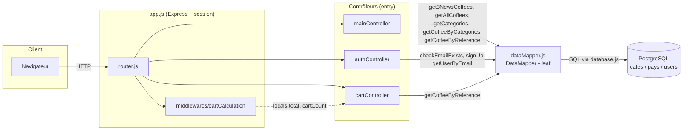
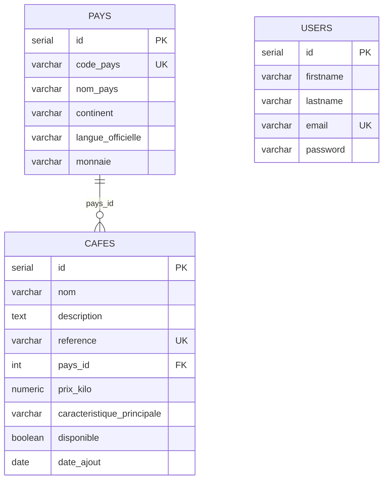
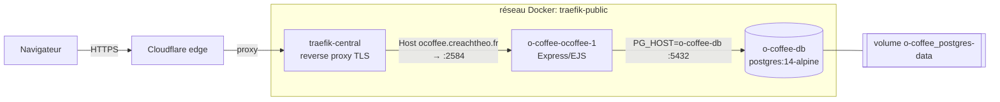

# Architecture — O'Coffee

> Cartographie générée à partir du graphe de code (`graphe-code-memory`).
> Dernière synchronisation : **2026-08-19** (post-corrections) — 264 nœuds, 308 arêtes.

## Vue d'ensemble

O'Coffee est une application web **MVC** légère : catalogue de cafés, panier en
session et authentification. Stack : **Express + EJS + PostgreSQL** (`pg`).

Le graphe distingue trois couches :

| Couche | Package | Rôle |
|--------|---------|------|
| `entry` | `controllers` | Reçoit les requêtes, orchestre (uniquement appels sortants) |
| `leaf`  | `dataMapper`  | Accès SQL centralisé (uniquement appelé, aucun appel sortant) |
| infra   | `database` / `middlewares` | Connexion pg + calcul du panier |

## Flux applicatif (routeur → contrôleurs → DataMapper → PostgreSQL)

## Carte des routes

| Méthode | Route | Contrôleur.Handler |
|---------|-------|--------------------|
| GET  | `/` | `mainController.homePage` |
| GET  | `/login` | `authController.loginPage` |
| POST | `/login` | `authController.loginPageAction` |
| GET  | `/logout` | `authController.logoutAction` |
| GET  | `/signup` | `authController.signUpPage` |
| POST | `/signup` | `authController.signUpPageAction` |
| GET  | `/account` | `authController.accountPage` |
| GET  | `/cart` | `cartController.cartPage` |
| GET  | `/cart/update/:reference/:quantity` | `cartController.update` |
| GET  | `/cart/add/:reference` | `cartController.addToCart` |
| GET  | `/cart/delete/:reference` | `cartController.deleteFromCart` |
| GET  | `/checkout` | `cartController.checkout` |
| GET  | `/detail/:reference` | `mainController.detailPage` |
| GET  | `/catalogue` | `mainController.cataloguePage` |
| GET  | `/catalogue/all` | `mainController.catalogueAllPage` |
| GET  | `/catalogue/category` | `mainController.catalogueCategoryPage` |
| GET  | `/about` | `mainController.aboutPage` |

> Le middleware `cartCalculation` est monté **après** les routes d'authentification
> et **avant** les routes panier/catalogue (`router.use(cartCalculations)`).

## Modèle de données

## DataMapper — surface d'accès aux données

| Méthode | Table(s) | Appelée par |
|---------|----------|-------------|
| `getAllCoffees()` | cafes | mainController |
| `get3NewsCoffees()` | cafes | mainController |
| `getCoffeeByReference(reference)` | cafes ⋈ pays | mainController, cartController |
| `getCoffeeByCategories(category)` | cafes | mainController |
| `getCategories()` | cafes | mainController |
| `checkEmailExists(email)` | users | authController |
| `signUp(...)` | users | authController |
| `getUserByEmail(email)` | users | authController |

## Infrastructure & déploiement (prod)

- Le site est servi par **Traefik** (labels dans `docker-compose.prod.yml`), lui-même
  derrière **Cloudflare**. Le tunnel Cloudflare du CI ne sert **qu'au SSH de déploiement**,
  pas au trafic web.
- **PostgreSQL tourne en conteneur** (`o-coffee-db`, `postgres:14-alpine`) sur le réseau
  `traefik-public`, données dans le volume `o-coffee_postgres-data`.
- ⚠️ **`PG_HOST` doit toujours être le _nom_ du conteneur (`o-coffee-db`), jamais une IP
  Docker** : les IP du bridge sont réattribuées à chaque recréation. Voir le postmortem
  [`docs/INCIDENT-2026-09-13-db-outage.md`](INCIDENT-2026-09-13-db-outage.md).

## Points de vigilance (voir `docs/AUDIT.md`)

Corrections C1–C6 appliquées sur la branche `fix/audit-corrections`. Restant :

1. ⏳ **CSRF** — dépendance `csrf-csrf` présente mais non branchée sur les POST.
2. ⏳ **Anti-bruteforce** — état en mémoire, non partagé entre instances.
